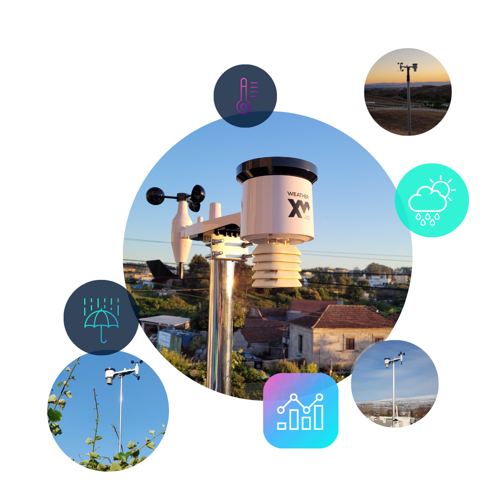

# Home Assistant - WeatherXM

[![GitHub Release][releases-shield]][releases]
[![GitHub Activity][commits-shield]][commits]
[![License][license-shield]](LICENSE)

![HACS][hacs-shield]

Home Assistant weather integration for WeatherXM weather stations.

## Table Of Contents
* [:computer: Installation](#-installation)
* [:gear: Configuration](#️-configuration)
* [:bulb: Usage](#-usage)
* [:yellow_heart: Say Thank You](#-say-thank-you)

## :computer: Installation

Click to expand installation steps...

### HACS (Preferred)
This integration can be added to Home Assistant as a [custom HACS repository](https://hacs.xyz/docs/faq/custom_repositories):
1. From the HACS page, click the 3 dots in the top right corner.
1. Select `Custom repositories`.
1. Add the URL `https://github.com/thenoctambulist/hass-wxm`.
1. Select the type `Integration`.
1. Click the ADD button.
1. Restart Home Assistant
1. Click the button below, or in the HA UI go to "Configuration" -> "Integrations" click "+" and search for "WeatherXM"

[![Add integration][my-hass-add-integration-img]][my-hass-add-integration]

### Manual
1. Download the latest release from [here](https://github.com/thenoctambulist/hass-wxm/releases).
1. Create a folder called `custom_components` in the same directory as the Home Assistant `configuration.yaml`.
1. Extract the contents of the zip into folder called `weatherxm` inside `custom_components`.
1. Restart Home Assistant
1. Click the button below, or in the HA UI go to "Configuration" -> "Integrations" click "+" and search for "WeatherXM"

[![Add integration][my-hass-add-integration-img]][my-hass-add-integration]

## :gear: Configuration
Configuration of the integration is performed using a config flow in the user interface.

To use this integration you will need a WeatherXM account. 
Weather data can be retrieved for your own weather stations or any weather stations followed in the official app.

## :bulb: Usage
This integration provides several entities representing the data from each weather station.

The entities are described in the following sections.

Tip: If you want to rename the entities, start by renaming the top-level device.

### :partly_sunny: Weather (`weather.<station_name>`)

For each weather station configured a [**weather**][hass-weather] entity is created.

The weather entity is named using the friendly name of the weather station defined in the WeatherXM app.

WeatherXM weather entities support hourly and daily forecasts.
Hourly forecasts are provided up to 48 hours in the future.

### :thermometer: Sensor: Weather Observation (`sensor.<station_name>_<sensor>`)
In addition to being published as part of the weather entity, individual [**sensor**][hass-sensor] entities are created to represent all current weather observations.
This allows the values to be more easily used in automations or other locations.

### :battery: Binary Sensor: Battery (`binary_sensor.<station_name>_battery`)
A [**binary sensor**][hass-binary] is created for each weather station to publish the current battery level.

States and Attributes

#### States
 State            | Description 
------------------|-------------
 `off` (`Normal`) | The weather station battery is healthy.
 `on` (`Low`)     | The battery in the weather station is getting low and will need to be replaced soon.

## :yellow_heart: Say Thank You
If you like this integration, please :star: the repository.

If you would like to make a donation as appreciation of my work:

***
[commits-shield]: https://img.shields.io/github/commit-activity/y/thenoctambulist/hass-wxm.svg
[commits]: https://github.com/thenoctambulist/hass-wxm/commits/main
[hacs-shield]: https://img.shields.io/badge/HACS-Custom-blue.svg
[hass-binary]: https://www.home-assistant.io/integrations/binary_sensor/
[hass-sensor]: https://www.home-assistant.io/integrations/sensor/
[hass-weather]: https://www.home-assistant.io/integrations/weather/
[license-shield]: https://img.shields.io/github/license/thenoctambulist/hass-wxm.svg
[my-hass-add-integration-img]: https://my.home-assistant.io/badges/config_flow_start.svg
[my-hass-add-integration]: https://my.home-assistant.io/redirect/config_flow_start/?domain=weatherxm
[releases-shield]: https://img.shields.io/github/release/thenoctambulist/hass-wxm.svg
[releases]: https://github.com/thenoctambulist/hass-wxm/releases
